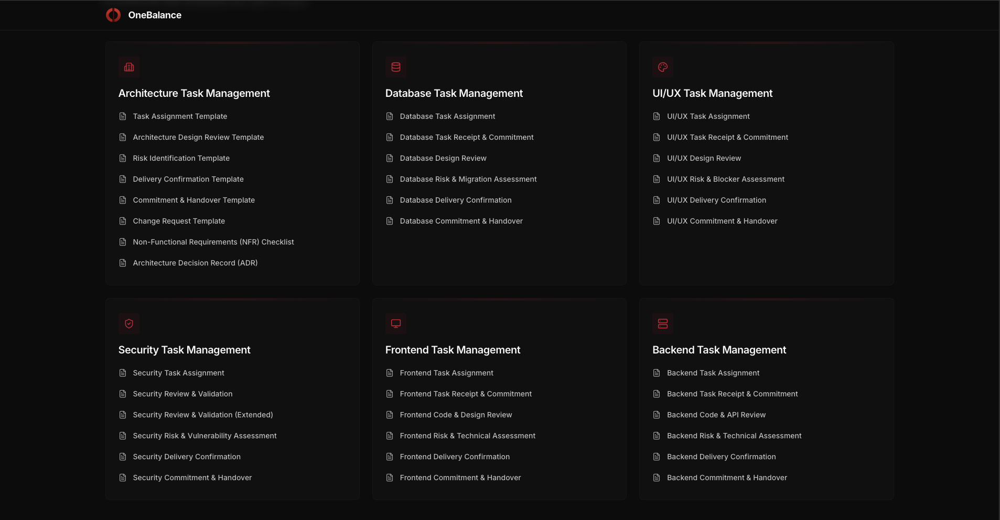

# OneBalance

**OneBalance** is a structured task management platform for software engineering teams. It provides 30 professionally designed, fillable templates across 6 engineering disciplines — Architecture, Database, UI/UX, Security, Frontend, and Backend.

Teams use OneBalance to fill out task forms, export them as branded PDFs, share them across the team, and re-upload PDFs to instantly restore all form data.

---

## What the App Does

| Feature | Description |
|---|---|
| 30 task templates | 6 categories × 5–8 templates each, covering every stage of a task lifecycle |
| Save as PDF | Export any filled form as a professional, branded PDF with one click |
| Upload PDF to Edit | Re-upload a previously saved PDF to restore all form data automatically |
| Fully client-side | No backend, no login, no database — everything runs in the browser |
| Offline capable | Works after the page loads, even without an internet connection |

---

## Template Categories

| Category | Templates |
|---|---|
| **Architecture** | Task Assignment, Design Review, Risk Identification, Delivery Confirmation, Commitment & Handover, Change Request, NFR Checklist, Architecture Decision Record (ADR) |
| **Database** | Task Assignment, Receipt & Commitment, Design Review, Risk & Migration Assessment, Delivery Confirmation, Commitment & Handover |
| **UI/UX** | Task Assignment, Receipt & Commitment, Design Review, Risk & Blocker Assessment, Delivery Confirmation, Commitment & Handover |
| **Security** | Task Assignment, Security Review, Extended Security Review (OWASP Top 10), Risk & Vulnerability Assessment, Delivery Confirmation, Commitment & Handover |
| **Frontend** | Task Assignment, Receipt & Commitment, Code & Design Review, Risk & Technical Assessment, Delivery Confirmation, Commitment & Handover |
| **Backend** | Task Assignment, Receipt & Commitment, Code & API Review, Risk & Technical Assessment, Delivery Confirmation, Commitment & Handover |

---

## Tech Stack

| Technology | Purpose |
|---|---|
| React 19 | UI framework |
| TypeScript | Type safety |
| Vite | Build tool & dev server |
| Tailwind CSS v4 | Styling |
| react-hook-form + Zod | Form management & validation |
| jsPDF | PDF generation (text-based, no screenshots) |
| pdfjs-dist | PDF parsing for re-upload feature |
| Framer Motion | Page & element animations |
| Wouter | Client-side routing |
| Radix UI | Accessible UI primitives (select, checkbox, etc.) |
| Lucide React | Icons |

---

## Prerequisites

Before running the project, make sure you have the following installed on your machine:

| Requirement | Minimum Version | How to Check |
|---|---|---|
| **Node.js** | v18.0.0 | `node -v` |
| **npm** | v9.0.0 | `npm -v` |
| A modern browser | Chrome 90+, Firefox 90+, Safari 15+, Edge 90+ | — |

Download Node.js (which includes npm) from: **https://nodejs.org**

---

## Installation & Running Locally

```bash
# Step 1 — Clone or download the project (see DOWNLOAD_FROM_REPLIT.md)

# Step 2 — Navigate into the app folder
cd Task-Management

# Step 3 — Install all dependencies
npm install

# Step 4 — Start the development server
npm run dev

# For run the build invironment 

# Step 1 - Run the build command
npm run build

# Step 2 - View the build invironment
npx serve dist/public
```

Open your browser at **http://localhost:5173**

### Available npm Scripts

| Command | What it does |
|---|---|
| `npm run dev` | Start the Vite development server with hot reload |
| `npm run build` | Build optimised production files to `dist/public/` |
| `npm run serve` | Preview the production build locally |
| `npm run typecheck` | Run TypeScript type checking |

---

## Project Structure

```
artifacts/task-templates/
├── public/
│   ├── logo.png            # OneBalance brand logo
│   └── favicon.svg         # Browser tab icon
├── src/
│   ├── components/
│   │   ├── layout/         # Header, page transitions
│   │   ├── home/           # Category cards on the home page
│   │   ├── templates/      # TemplateForm, FormFields, PdfActions
│   │   └── ui/             # Radix UI + Tailwind component library
│   ├── data/
│   │   └── templates.ts    # All 30 template definitions with fields
│   ├── hooks/
│   │   └── use-template-form.ts  # Form state, PDF save, PDF upload logic
│   ├── lib/
│   │   ├── pdf-generator.ts      # jsPDF text-based PDF builder
│   │   └── pdf-parser.ts         # pdfjs-dist PDF data extractor
│   ├── pages/
│   │   ├── HomePage.tsx          # Landing page with category grid
│   │   └── TemplatePage.tsx      # Individual template form page
│   ├── App.tsx                   # Router setup
│   ├── main.tsx                  # React entry point
│   └── index.css                 # Global styles & Tailwind setup
├── index.html                    # HTML entry point
├── package.json                  # Dependencies & npm scripts
├── vite.config.ts                # Vite configuration
└── tsconfig.json                 # TypeScript configuration
```

---

## How the PDF Save & Reload Works

**Saving:**
1. You fill out the form fields in the browser.
2. Clicking "Save as PDF" calls `jsPDF` to render each field as formatted text onto a PDF canvas.
3. Your form data is JSON-encoded, Base64-encoded, and embedded in the PDF's **Keywords metadata field** (invisible to readers, readable by the parser).
4. The PDF is downloaded to your computer.

**Re-uploading:**
1. You click "Upload PDF to Edit" and select a previously saved OneBalance PDF.
2. `pdfjs-dist` loads the PDF and reads its metadata keywords field.
3. The Base64 payload is decoded back to JSON.
4. All form fields are instantly re-populated with your saved data.

---

## Branding & Customisation

- **Logo:** `Task-Management/public/logo.png`
- **Brand name:** Search for `OneBalance` across `src/` to find all display references.
- **Colours:** The red/black/white theme is defined in `src/index.css` (CSS variables) and `src/lib/pdf-generator.ts` (PDF colour constants).
- **Templates:** All field definitions live in `src/data/templates.ts` — add, remove, or edit fields there.

---

## Environment Variables

| Variable | Required | Description |
|---|---|---|
| `PORT` | Yes (Replit) / Optional locally | Port the dev server binds to |
| `BASE_PATH` | Yes (Replit) / Optional locally | URL base path (use `/` locally) |

When running locally, pass them inline:

```bash
npm run dev
```

Or create a `.env` file in `Task-Management/`:

```
PORT=5173
BASE_PATH=/
```